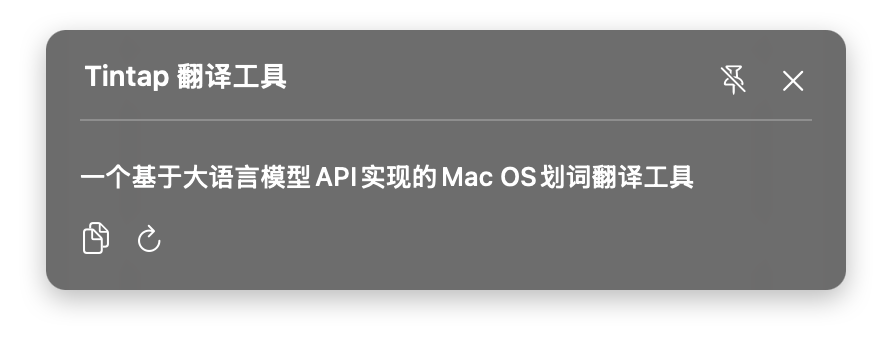
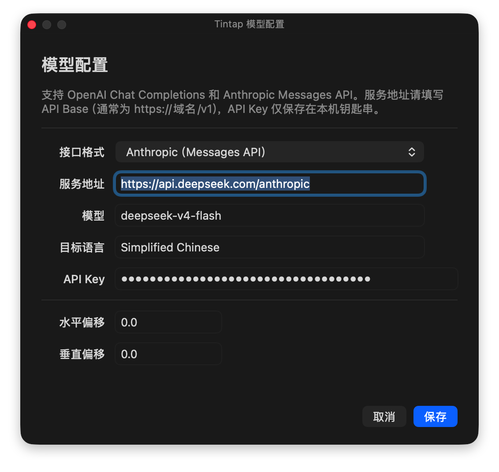

# Tintap

<p align="center">
  
</p>

Tintap 是一个原生 macOS 划词翻译工具。用户在任意已支持辅助功能的应用中选中文本后，Tintap 会在选区附近显示紧凑 Tooltip，并通过可配置的模型服务返回翻译结果。

## 界面预览

初始 Tooltip 提供翻译、复制与拖动操作：


翻译完成后，结果会在选区附近的面板中展示：



可在模型配置窗口中设置兼容 OpenAI Chat Completions 或 Anthropic Messages API 的服务：



## 功能

- 全局划词：拖拽、双击选词后显示邻近 Tooltip。
- 三态 Tooltip：初始态提供翻译、复制选中文本与拖动操作；翻译中显示进度；结果态展示可滚动阅读的翻译、重试和复制操作。
- 结果面板：固定阅读宽度、内容高度自适应，并限制最大高度。
- 交互：Tooltip 可拖动；结果态支持关闭与固定浮窗；未固定时点击外部会关闭。点击 Tooltip 本身不会重置当前结果。
- 智能定位：优先使用辅助功能提供的选区边界；空间不足时自动翻转并限制在当前屏幕可见区域。设置中可配置 X/Y 偏移。
- 模型服务：支持 OpenAI Chat Completions 兼容接口和 Anthropic Messages API。
- 凭据安全：API Key 仅保存在本机 Keychain；其余模型配置保存在 UserDefaults。
- VS Code / Chromium 兼容：无法通过辅助功能读取选区时，可短暂模拟 `Command-C`，读取选中文本后恢复原剪贴板内容。
- 菜单栏控制：可随时启用或禁用全局划词；辅助功能授权在生效后会自动恢复监听。

## 系统要求

- macOS 14 或更高版本。
- 在“系统设置 → 隐私与安全性 → 辅助功能”中允许 Tintap。

## 运行

```zsh
swift run
```

首次运行时，按系统提示授予辅助功能权限。若在系统设置中授权，Tintap 会自动检测权限并开始全局划词监听；也可从菜单栏确认“启用划词工具”处于勾选状态。

使用流程：

1. 从菜单栏 Tintap 图标打开“设置…”。
2. 填写接口格式、服务地址、模型、目标语言和 API Key，保存配置。
3. 在 TextEdit、Safari、VS Code 或其他应用中选中文本。
4. 在 Tooltip 中点击“翻译”，等待并查看结果。

## 模型配置

### OpenAI Chat Completions 兼容接口

服务地址填写 API Base，例如：

```text
https://api.openai.com/v1
```

Tintap 会自动请求：

```text
/chat/completions
```

若地址已经以 `/chat/completions` 结尾，则不会重复追加。

### Anthropic Messages API

服务地址同样填写 API Base。Tintap 会自动补全为：

```text
/v1/messages
```

例如 DeepSeek 的 Anthropic 兼容地址可填写：

```text
https://api.deepseek.com/anthropic
```

最终请求地址为：

```text
https://api.deepseek.com/anthropic/v1/messages
```

不要填写服务商控制台或网页地址；若接口返回 HTML，Tintap 会提示该地址不是 API Base。

## VS Code 与浏览器划词

VS Code 和 Chromium 内核浏览器使用的辅助功能树与原生 AppKit 编辑器不同。建议先在 VS Code 用户设置中加入并重启编辑器：

```json
"editor.accessibilitySupport": "on"
```

若目标应用没有公开聚焦元素、选中文本或选区边界，Tintap 会在拖拽或双击选中后使用剪贴板回退：发送一次 `Command-C`、读取文本、恢复之前的剪贴板，并以鼠标抬起位置定位 Tooltip。

如需禁用该回退机制：

```zsh
TINTAP_CLIPBOARD_FALLBACK=0 swift run
```

密码框等安全输入控件不会使用剪贴板回退。

## 调试与 UI 预览

启用运行日志：

```zsh
TINTAP_DEBUG=1 swift run
```

日志会输出辅助功能授权、全局监听安装、选区来源、剪贴板回退和 Tooltip 坐标等信息。

无需真实划词即可预览 Tooltip 状态：

```zsh
TINTAP_UI_PREVIEW=compact swift run
TINTAP_UI_PREVIEW=progress swift run
TINTAP_UI_PREVIEW=result swift run
TINTAP_UI_PREVIEW=long-result swift run
```

也支持传入参数形式，例如：

```zsh
swift run Tintap --ui-preview=result
```

## 测试

```zsh
swift test
```

测试覆盖模型 URL 归一化、OpenAI / Anthropic 响应解析、错误映射、翻译缓存和 Tooltip 尺寸规范。

## 打包生产应用

`swift build -c release` 只会更新 `.build` 中的可执行文件，不会更新生产包。请使用：

```zsh
zsh scripts/package.sh
```

替换已有生产包：

```zsh
zsh scripts/package.sh --replace
```

产物位于：

```text
dist/Tintap.app
```

脚本会复制应用图标和菜单栏图标，并以 ad-hoc 签名生成应用包。每次替换 `dist/Tintap.app` 后，请确认系统设置中授权的是该生产包本身，而不是 `swift run` 生成的开发可执行文件。

若本机 Command Line Tools 与默认 SDK 版本不匹配，可显式指定 SDK：

```zsh
TINTAP_SDK=/Library/Developer/CommandLineTools/SDKs/MacOSX15.4.sdk \
zsh scripts/package.sh --replace
```

## GitHub 自动发布

仓库使用 `vMAJOR.MINOR.PATCH` 标签触发 GitHub Actions 发布。例如应用版本为 `0.2.0` 时，在对应的 `main` 提交上推送 `v0.2.0` 标签。工作流会在 macOS arm64 和 Intel 环境中分别测试、打包，并创建包含两个架构 ZIP 和 SHA-256 校验文件的 GitHub Release。

当前自动发布产物使用 ad-hoc 签名且未经 Apple 公证，用户首次打开时需要手动允许应用运行。完整的分支、版本和发布步骤见 [发布规则](docs/RELEASING.md)。
